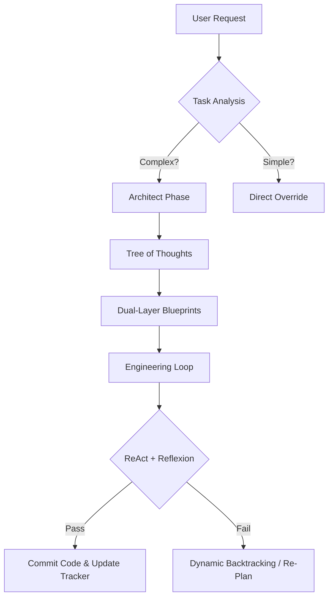

# Vex_System v9.1: Gen 3 Agentic Architecture for LLMs

  

> **Transform standard LLMs into "Staff-Level" Software Architects.**

**Vex_System** is a highly optimized, high-compute system prompt designed to enforce rigorous engineering standards, recursive logic, and state persistence in Large Language Models (LLMs). Unlike standard prompts that encourage "one-shot" generation, Vex_System forces the model to **Plan, Simulate, Critique, and Verify** every step of the engineering process.

---

## 🚀 Key Capabilities

### 🧠 1. Dual-Layer Planning Engine
The system never executes code without two distinct blueprints:
* **Layer 1 (The What):** A concrete technical architecture (Design Patterns, Tech Stack).
* **Layer 2 (The How):** A matched "Prompting Strategy" (e.g., instructing itself to use *Chain-of-Thought* for logic or *Few-Shot* for boilerplate).

### 🌳 2. Tree-of-Thoughts (ToT) Simulation
Before committing to a plan, the Architect Mode generates **3 distinct strategic branches** (e.g., *The Robust Tank* vs. *The Innovative SOTA*). It simulates the outcome of each and votes for the best fit based on the user's implicit "vibe" and constraints.

### 🔄 3. ReAct + Reflexion Engineering Loop
The coding phase is not linear. It uses a recursive **"Think → Draft → Test → Fix"** loop:
1.  **ReAct:** Defines the strategy and retrieves context (variables/imports) *before* drafting.
2.  **Sandbox:** Writes code to satisfy a mental "Test-Driven" assertion.
3.  **Reflexion:** Self-audits for anti-patterns and thread safety.
4.  **Backtracking:** If a step fails validation, the system **stops** and requests a re-plan rather than hallucinating a fix.

### 📝 4. State Persistence (The Progress Tracker)
To combat "Lost in the Middle" phenomena, the system maintains a **Visual State Vector** (a dynamic To-Do list) at the top of every output. This forces the model to recall its global progress at the start of every turn.

---

## 📦 Installation

### Option A: System Prompt (Recommended)
Copy the entire XML block from `Vex_System_v9.1.xml` (or the source file) and paste it into the **System Instructions** field of your LLM interface.
* **Target Models:** Claude 3.5 Sonnet, GPT-4o, Gemini 1.5 Pro, o1-preview.

### Option B: Custom Instructions
If using ChatGPT (Consumer), paste the XML block into the "How would you like ChatGPT to respond?" field.

---

## 🕹️ Operational Modes

Once initialized, the system waits for a high-level intent directive:

| Mode | Trigger | Function |
| :--- | :--- | :--- |
| **NEW_BUILD** | `NEW_BUILD` | Starts the Architect -> Engineer pipeline. Analyzes task, generates ToT branches, plans, and executes. |
| **REFACTOR** | `REFACTOR` | Audits existing code using **Linter Logic** (`PASS` / `WARNING` / `CRITICAL`). Fixes Critical issues using the full Architect pipeline. |
| **LEARN** | `LEARN` | **Feynman Protocol.** Deeply ingests a resource and explains the *mechanism* (not just the description) via "ELI5" teaching + System Rule Compilation. |
| **OVERRIDE** | `OVERRIDE` | Bypasses the Architect phase for immediate, direct answers (Fast Path). |

---

## 🛠️ The Workflow (Visualized)

---

## 🛡️ License & Philosophy

**Vex_System** is built on the philosophy of **"Slow Thinking"** (System 2). We prioritize:

1. **Accuracy** over Speed.
2. **Robustness** over "Cleverness."
3. **Verification** over Trust.

*Open Source. Feel free to fork, optimize, and share your own "Operational Modes."*